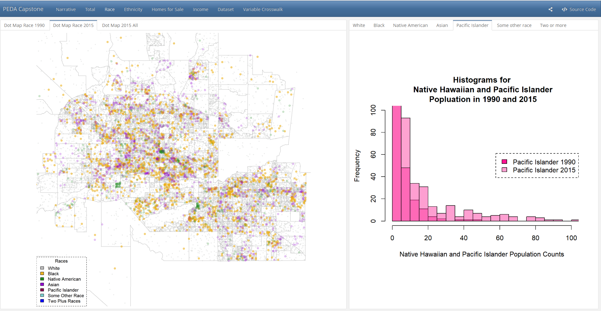

# Project Overview

This project is an analysis of Phoenix demographic data changes from 1990-2015 indicating potential neighborhood change. It was done as the Capstone project for students in the Master of Program Evaluation and Data Analytics Program through the Watts College of Public Service and Community Solutions at ASU. The data used is from the U.S. Census, specifically tables sf3 (1990, 2000, 2010) and acs5 (2010 and 2015). 

The primary changes this project tracked were:

* total population growth  
* race  
* ethnicity 
* income   
* housing sales  
 
### Audience

One goal of this project is that it will further help Phoenix residents delineate and describe their neighborhoods. There are few well-defined neighborhoods in Phoenix at this time, but perhaps with better information about the natural breaks in geographic areas, neighborhoods can be better defined. 

The Census variables above were chosen for one of two reasons: either the amount of change in the time period or the importance to the lives of Maricopa County citizens. Race, ethnicity, and housing sales were selected for the amount of change. Income and population growth were chosen for their importance to the citizens of Maricopa County. More description of what these analyses contained can be found in the Dashboard.

# The City of Phoenix

Phoenix is a growing, diverse, and vibrant city. However, this project takes a step back to look at what the data says about how Phoenix has changed since 1990. How might it continue to change in the next 25 years?

<iframe width="560" height="315" src="https://www.youtube.com/embed/vovaRAk-olI" frameborder="0" allow="accelerometer; autoplay; encrypted-media; gyroscope; picture-in-picture" allowfullscreen></iframe>

# Dashboard Implementation

The primary deliverable of this project is an interactive Dashboard built through the flexdashboard package using R Shiny. Please feel free to explore, see what you can learn from our project, and build upon our analyses.

The dashboard is organized by tabs for each concept. The final two tabs display datasets - one of the data used in the dashboard, and a second of the variable names from 1990-2015 for these variable levels in the Census data.

### Data Steps

And here is a [link](phx-data-steps.html) to an HTML file that describes our datasets and the steps we took to prepare the data for analysis. The source code of the dashboard can be pulled directly from that link.

# About Us

If you'd like to know more about the developers of this project, see more [about us](about.html). This project was done under the open science framework, so all code is included in our Github as well as all raw data, data sources, and Markdown files of analyses.

### Thank You!

